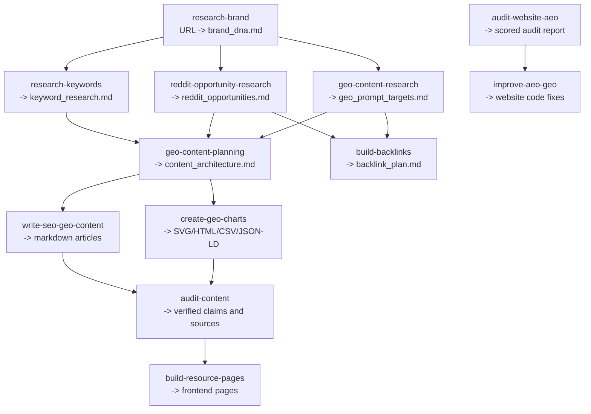

# GTM Engineer Skills

Agent skills for modern go-to-market engineering: brand research, SEO, GEO, Reddit opportunity research, content planning, AI-citable charts, resource pages, AEO audits, backlink discovery, and code-level website improvements.

This repo is for teams that want AI agents to do more than write generic marketing copy. Each skill produces concrete artifacts an operator can review, publish, test, or feed into the next step.

<p align="center">
  
</p>

## What this repo helps you do

| Goal | Skills to use | Output |
| --- | --- | --- |
| Understand a market and brand | `research-brand`, `research-keywords`, `geo-content-research` | Brand DNA, SEO/GEO keyword clusters, AI prompt targets |
| Find demand in real communities | `reddit-opportunity-research`, `build-backlinks` | Subreddit opportunities, thread patterns, backlink and mention plan |
| Plan content that can rank and get cited | `geo-content-planning`, `write-seo-geo-content` | Content architecture, product-led article drafts, page briefs |
| Add evidence and visual assets | `create-geo-charts`, `audit-content` | AI-readable charts, data tables, JSON-LD, source verification |
| Ship resource pages | `build-resource-pages` | Frontend pages built into a client codebase |
| Improve AI discoverability | `audit-website-aeo`, `improve-aeo-geo` | A-F audit report, prioritized fixes, code changes |

## Why it exists

Search is shifting from ranked blue links to answer engines: ChatGPT, Claude, Perplexity, Google AI Overviews, and other AI surfaces. Winning there requires different work:

- Pages need direct answers, clear structure, sources, and quotable passages.
- Charts need text layers, tables, and structured data, not just pixels.
- Content plans need to account for prompts, communities, and citations, not only keyword volume.
- Websites need technical signals that crawlers and AI systems can parse reliably.

These skills turn that work into repeatable agent workflows.

## Workflow

The skills are designed to run as a pipeline. Each stage creates files that become context for the next stage.



## Quickstart

Clone the repo, then symlink the skills you want into your agent's skill directory.

```bash
git clone https://github.com/onvoyage-ai/gtm-engineer-skills.git
cd gtm-engineer-skills
```

### Codex

```bash
mkdir -p ~/.codex/skills
ln -s "$PWD/research-brand" ~/.codex/skills/research-brand
ln -s "$PWD/research-keywords" ~/.codex/skills/research-keywords
ln -s "$PWD/geo-content-planning" ~/.codex/skills/geo-content-planning
ln -s "$PWD/audit-website-aeo" ~/.codex/skills/audit-website-aeo
```

### Claude Code

```bash
mkdir -p ~/.claude/skills
ln -s "$PWD/research-brand" ~/.claude/skills/research-brand
ln -s "$PWD/research-keywords" ~/.claude/skills/research-keywords
ln -s "$PWD/geo-content-planning" ~/.claude/skills/geo-content-planning
ln -s "$PWD/audit-website-aeo" ~/.claude/skills/audit-website-aeo
```

Each skill folder contains a `SKILL.md` file and, when useful, a README, examples, scripts, or schemas.

## Example prompts

Use one skill at a time:

```text
Use research-brand on https://example.com and create brand_dna.md.
```

```text
Use research-keywords with brand_dna.md to find SEO and GEO keyword clusters for this product category.
```

```text
Use audit-website-aeo on https://example.com with a 20 page crawl and produce a prioritized AEO/GEO audit.
```

Or run a longer workflow:

```text
Use this repo's GTM skills to research the brand, find SEO/GEO opportunities,
build a content architecture, draft the first two resource pages, and audit the
claims before publishing.
```

## Skills

| Skill | Use it for | Main output |
| --- | --- | --- |
| [`research-brand`](research-brand/) | Understand positioning, audience, competitors, voice, and messaging from a company URL | `brand_dna.md` |
| [`research-keywords`](research-keywords/) | Find SEO and GEO keywords using web research, AI analysis, and optional SERP scripts | `keyword_research.md` |
| [`reddit-opportunity-research`](reddit-opportunity-research/) | Discover Reddit pain points, subreddits, thread patterns, and user language | `reddit_opportunities.md` |
| [`geo-content-research`](geo-content-research/) | Identify prompts people ask AI engines about a category | `geo_prompt_targets.md` |
| [`geo-content-planning`](geo-content-planning/) | Turn research into a page architecture with priority, URLs, and page types | `content_architecture.md` |
| [`write-seo-geo-content`](write-seo-geo-content/) | Draft product-led content optimized for search and AI citation | Markdown articles with frontmatter |
| [`create-geo-charts`](create-geo-charts/) | Produce data visualizations with text summaries, HTML tables, CSV, and JSON-LD | AI-readable chart packages |
| [`audit-content`](audit-content/) | Verify URLs, statistics, claims, source attribution, and internal consistency | Audit report |
| [`build-resource-pages`](build-resource-pages/) | Build resource center pages inside a client codebase | Frontend implementation |
| [`audit-website-aeo`](audit-website-aeo/) | Crawl a live site and score AI discoverability with deterministic and content checks | `aeo_audit_report.md` |
| [`improve-aeo-geo`](improve-aeo-geo/) | Apply code-level AEO/GEO fixes to a website | Website code changes |
| [`build-backlinks`](build-backlinks/) | Find free backlink and mention opportunities across communities and directories | `backlink_plan.md` |

## Sample outputs and examples

- [`audit-website-aeo/examples/anthropic-com-audit.md`](audit-website-aeo/examples/anthropic-com-audit.md): example scored AEO/GEO audit.
- [`improve-aeo-geo/examples/nextjs-blog-before-after.md`](improve-aeo-geo/examples/nextjs-blog-before-after.md): before/after improvement plan for a Next.js blog.
- [`improve-aeo-geo/examples/wordpress-business-before-after.md`](improve-aeo-geo/examples/wordpress-business-before-after.md): before/after improvement plan for a WordPress business site.
- [`create-geo-charts/examples/`](create-geo-charts/examples/): sample charts, CSV datasets, and HTML outputs.
- [`geo-content-planning/plan.csv.schema.md`](geo-content-planning/plan.csv.schema.md): content plan CSV contract.
- [`research-keywords/keywords.csv.schema.md`](research-keywords/keywords.csv.schema.md): keyword CSV contract.
- [`geo-content-research/prompts.csv.schema.md`](geo-content-research/prompts.csv.schema.md): GEO prompt CSV contract.

## Built-in tools

Some skills include scripts for deterministic or higher-volume work:

| Tool | Location | Purpose |
| --- | --- | --- |
| AEO crawler | [`audit-website-aeo/scripts/aeo-audit.mjs`](audit-website-aeo/scripts/aeo-audit.mjs) | Zero-dependency Node crawler for 16 foundational AEO checks |
| Keyword explorer | [`research-keywords/scripts/keyword-explorer.mjs`](research-keywords/scripts/keyword-explorer.mjs) | Autocomplete, PAA, related search, and SERP feature discovery |
| SERP analyzer | [`research-keywords/scripts/serp-analyzer.mjs`](research-keywords/scripts/serp-analyzer.mjs) | Competitive SERP analysis and AI Overview opportunity detection |

Run the eval suite with:

```bash
npm run test:evals
```

The evals currently cover CSV contract validation and deterministic regressions for the AEO crawler.

## Research references

This repo's AEO/GEO guidance is grounded in published research and large-scale industry studies, including:

- GEO paper, KDD 2024: https://arxiv.org/abs/2311.09735
- SE Ranking AI Mode optimization study: https://seranking.com/blog/how-to-optimize-for-ai-mode/
- Growth Memo AI citation analysis: https://www.growth-memo.com/p/the-science-of-how-ai-pays-attention
- Ahrefs freshness and AI citation study: https://ahrefs.com/blog/do-ai-assistants-prefer-to-cite-fresh-content/
- Conductor AEO/GEO benchmarks: https://www.conductor.com/academy/aeo-geo-benchmarks-report/
- AirOps LLM content structure report: https://www.airops.com/report/structuring-content-for-llms

## Platform notes

- The skills work with both Codex and Claude Code because each skill is packaged as a folder with `SKILL.md`.
- Reddit access differs by product. ChatGPT has native Reddit access in-product; Claude generally does not, so outputs may vary by environment.
- SEO keywords should be short search phrases. GEO prompts should be complete user questions.
- Do not fabricate data. Every statistic, benchmark, and third-party claim should have a source.

## Contributing

See [`CONTRIBUTING.md`](CONTRIBUTING.md) for how to add skills, improve workflows, or contribute examples.

When adding or changing a skill, prefer:

- A clear `SKILL.md` with trigger conditions and workflow steps.
- A README that explains usage, outputs, and examples.
- Schemas for structured CSV/JSON outputs.
- Offline tests when behavior can be validated deterministically.

## License

MIT, see [`LICENSE`](LICENSE).
